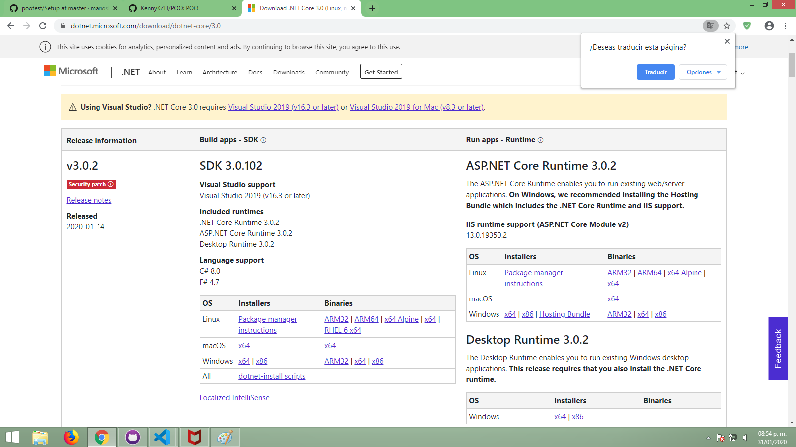
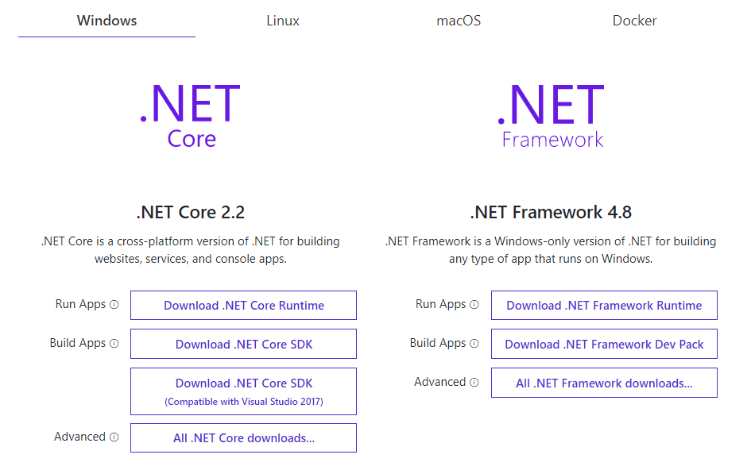
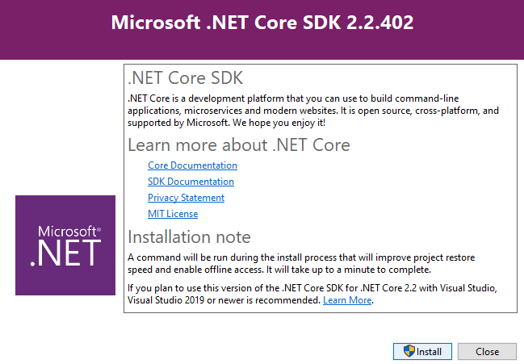
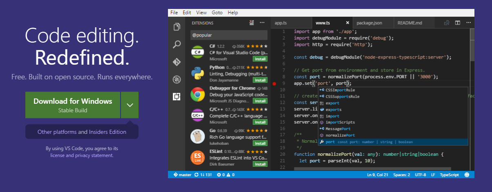
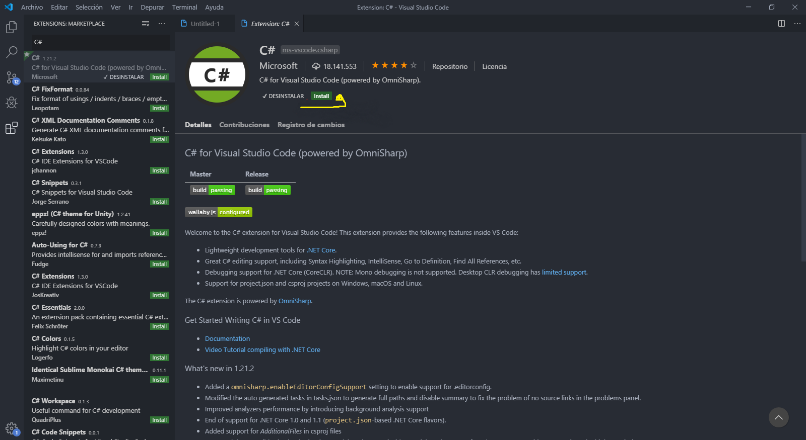
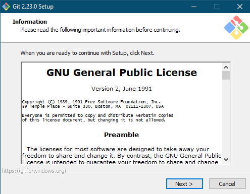
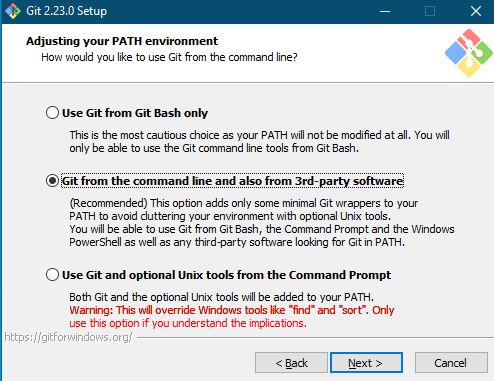
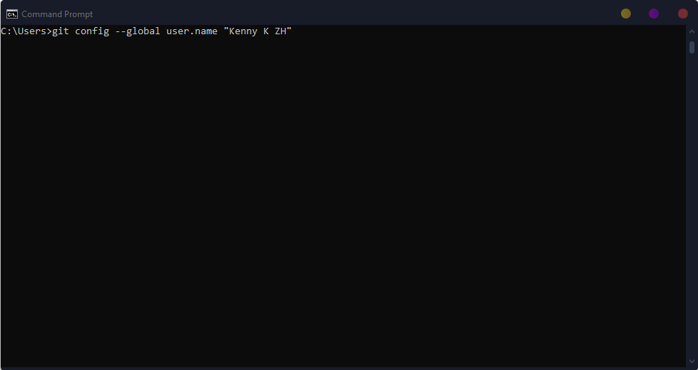
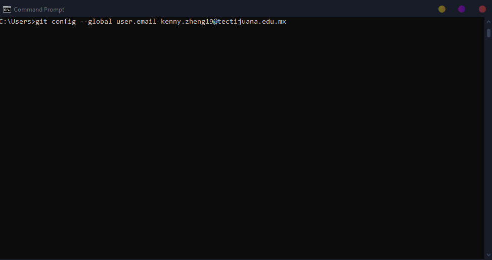

#Ejercicio de Markdown

# Ejercicio de Markdown

## Instalación de dotnet core 2.2.

lo primero que tenemos que hacer es bajar el archivo
[lugar](https://dotnet.microsoft.com/download/dotnet-core/3.0)
es importante bajar el SDK por que **vamos a programar**

la pagina se ve asi:

Como instalar Dotnet Core 2.2

1.-Ingresamos en nuestro navegador .NET Core

2.-Seleccionamos el enlace de NET Core-Net-Microsoft

3.-En las opciones que aparecen seleccionamos Download .NET Core SDK

4.-Una vez descargado lo abrimos

5.-Seleccionamos la opcion install y esperamos

6.-Cuando termine la instalacion cerramos y reiniciamos si el sistema nos lo indica

Instalación y configuración de Visual Studio Code para C#

1-Ingresamos en nuestro navegador Visual Studio Code

2.-Seleccionamos el enlace de Visual Studio Code - Code Editing. Redefined

3.-Seleccionamos la uncica opcion de descarga

4.-Una vez descargado lo abrimos

5.-Aceptamos los terminos y condiciones,damos todo siguiente hasta finalizar

Configuracion de Visual Studio Code

1.-Abrimos Visual Studio Code

2.-Seleccionamos la opcion de extensiones al lado izquierdo de la pantalla

3.-Se desplegara un buscador e ingresamos C#

4.-Confirmamos que la primera opcion sea solo C# y seleccionamos instalar

Instalación de git. conectado a tu cuenta de GitHub y VSC.

1-Ingresamos en nuestro navegador Git

2.-Seleccionamos el enlace de Git

3.-Seleccionamos la opcion de windows

4.-Cuando termine de descargarse lo abrimos

5.-Seleccionamos Next

6.-Seguimos Seleccionando opciones de nuestros gustos hasta llegar a Adjusting your PATH enviroment

7.-Y seleccionamos Git from the command line and also from 3rd-party software.

8.-Despues la opcion Use de OpenSSL library.

9.-Despues la opcion Checkout Windows-style, commit Unix-style line endings.

10.-Despues la opcion Use windows' default console window

11.-Despues dejamos 3 opciones sin marcar

12.-Despues dejamos la opcion seleccionada

13.-Por ultimo seleccionamos instalar y cuando termine finalizar

Configuracion de Git

1.-Abrimos Ejecutar presionando la Tecla de windows + R y insertamos cmd

2.-Ejecutamos el comando con nuestro Usuario: git config --global user.name "USUARIO"

3.-Despues el otro comando con nuestro Correo: git config --global user.email "CORREO"

4.-Cerramos y quedara configurado Git
